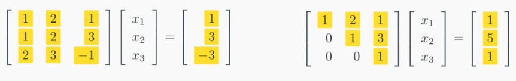
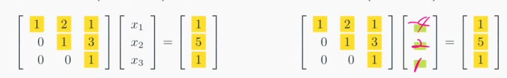
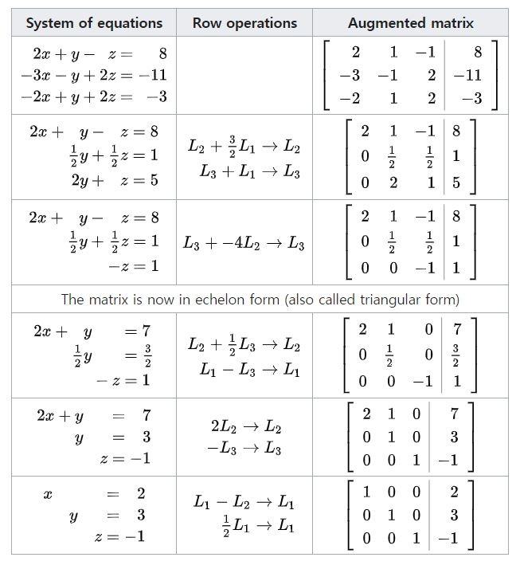

# Solution of Linear System

## Gaussian elimination
In mathematics, Gaussian elimination, also known as row reduction, is an algorithm for solving systems of linear equations. It consists of a sequence of operations performed on the corresponding matrix of coefficients.

https://en.wikipedia.org/wiki/Gaussian_elimination

### Forward elimination

### Back-substitution

## All process

